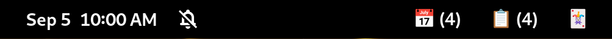

## Gnome Shell Trello Cards

Simple gnome extension that allows you to interact with your trello cards in gnome shell.

_Extremely experimental_ and requires [tro](https://github.com/MichaelAquilina/tro) installed.

Not really meant for public use yet and more of a personal project at this stage.

